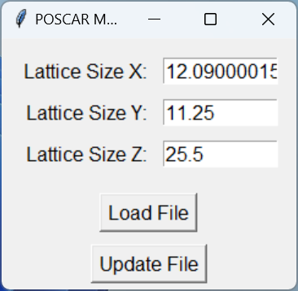

# POSCAR Manager GUI (Tkinter + Python)

A user-friendly graphical interface (GUI) for managing and modifying POSCAR files, widely used in computational material science (e.g., VASP). This tool provides intuitive functionality to:

- Load a POSCAR file and display its lattice sizes and atom positions.
- Modify the lattice sizes independently along each axis (X, Y, Z).
- Automatically adjust atom positions to preserve the fractional coordinate system.
- Save the updated file while retaining the original POSCAR header.
- Notify the user if any atom position exceeds fractional bounds (`> 1.0`).

> **Created through a collaboration between myself and my wife,  
> [Zeinab Hajali Fard](https://scholar.google.com/citations?user=uvxuhmIAAAAJ&hl=en), Ph.D. student at ISU.**

---

## Features

### Input and Display:
1. Load a POSCAR file:
   - Automatically extracts lattice sizes (diagonal elements) and atom positions.
2. Interactive lattice size modification:
   - Update sizes along X, Y, Z axes independently.

### Output and Validation:
1. Save updated POSCAR files:
   - Retains the original file header and metadata.
   - Updates lattice sizes and adjusts atom positions accordingly.
2. Validation:
   - Warns if any atom position exceeds `1.0`.

### Intuitive GUI:
- Clean layout with labeled input fields for lattice sizes.
- Buttons for loading and saving POSCAR files.
- Warning pop-ups for invalid atom positions.

---

## Screenshot



---

## Requirements

### Prerequisites
- Python 3.8 or higher

### Dependencies
Install the required Python packages:
```bash
pip install -r requirements.txt
```

---

## Getting Started

### Clone the Repository
```bash
git clone https://github.com/shahabafshar/POSCARMAN.git
cd POSCARMAN
```

### Install Dependencies
```bash
pip install -r requirements.txt
```

### Run the Application
```bash
python main.py
```

### Using the GUI
1. **Load POSCAR File**:
   - Click "Load File" and select a POSCAR file to load.
   - The lattice sizes (X, Y, Z) will be displayed in the input fields.
2. **Edit Lattice Sizes**:
   - Update lattice sizes by entering new values in the corresponding fields.
3. **Save Updated File**:
   - Click "Update File" to save the changes.
   - If any atom position exceeds `1.0`, a warning will appear.
   - Select a filename and save location for the updated POSCAR file.

---

## File Structure

```
POSCARMAN/
├── main.py                # Main GUI application
├── read_write_poscar.py   # Logic for reading and writing POSCAR files
├── requirements.txt       # Dependencies
├── README.md              # Project documentation
└── ...
```

---

## Creating an Executable

You can create a standalone executable using PyInstaller:

### Steps:
1. Install PyInstaller:
   ```bash
   pip install pyinstaller
   ```
2. Build the executable:
   ```bash
   pyinstaller --onefile --windowed main.py
   ```
3. The executable will be available in the `dist` folder:
   ```bash
   dist/main.exe
   ```

### Notes:
- The `--windowed` flag prevents a terminal window from appearing when the GUI runs.
- Ensure all necessary files (e.g., POSCAR examples) are in the same directory when distributing the executable.

---

## Referencing This Work

If you use or build upon this project in an **academic** or **research** context, please **cite** the sitory and the authors (yourself and *Zeinab Hajalifard*) accordingly. For example, using an **IEEE-style reference**:

```
[1] S. Afsharghoochani and Z. Hajali Fard, "POSCAR Manager GUI (Tkinter + Python)", 
GitHub repository, 2025. [Online]. Available: https://github.com/shahabafshar/POSCARMAN
```

---

## Example Flow

1. Start the GUI:
   ```bash
   python main.py
   ```
2. Load a POSCAR file:
   - Click "Load File" and select a POSCAR file.
   - Lattice sizes and atom positions will be displayed.
3. Edit lattice sizes:
   - Enter new sizes in the `Lattice Size X`, `Lattice Size Y`, and `Lattice Size Z` fields.
4. Save the updated file:
   - Click "Update File."
   - Choose a save location for the updated file.
   - Warnings will appear if atom positions exceed fractional bounds (`> 1.0`).

---

## Contributing

We welcome contributions to this project! Follow these steps:
1. Fork the repository.
2. Create a feature branch:
   ```bash
   git checkout -b feature/awesome-feature
   ```
3. Commit your changes:
   ```bash
   git commit -m "Add awesome feature"
   ```
4. Push your branch:
   ```bash
   git push origin feature/awesome-feature
   ```
5. Submit a pull request.

---

## License

This project is licensed under the MIT License. You are free to use, modify, and distribute this software in accordance with the license terms.

---

## Acknowledgments

- **Tkinter**: For the GUI framework.
- **Python**: For enabling quick and robust development.
- **Users and Contributors**: For their feedback and support.

---

Enjoy managing your POSCAR files! If you have questions or encounter issues, please open an Issue on GitHub.
